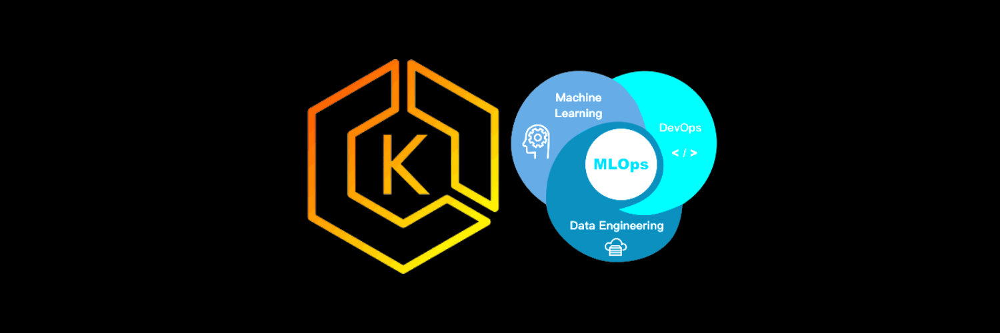

# Kubernetes MLOps

<!-- PROJECT LOGO -->
<br />
<p align="center">
  <a href="https://github.com/dao-duc-tung/eks-ml-deploy-system">
    
  </a>

  <h3 align="center">Kubernetes MLOps</h3>
</p>

<!-- TABLE OF CONTENTS -->
<details open="open">
  <summary>Table of Contents</summary>
  <ol>
    <li><a href="#introduction">Introduction</a></li>
    <li><a href="#build-a-simple-ml-app">Build a simple ML app</a></li>
    <li><a href="#deploy-to-local-kubernetes">Deploy to local Kubernetes</a></li>
    <li><a href="#deploy-to-eks-using-imperative-commands">Deploy to EKS using Imperative commands</a></li>
    <li><a href="#deploy-to-eks-using-yaml-configuration-files">Deploy to EKS using YAML configuration files</a></li>
    <li><a href="#deploy-to-eks-using-helm">Deploy to EKS using Helm</a></li>
    <li><a href="#deploy-to-eks-using-seldon-core">Deploy to EKS using Seldon-core</a></li>
    <li><a href="#cleanup">Cleanup</a></li>
    <li><a href="#license">License</a></li>
    <li><a href="#contact">Contact</a></li>
  </ol>
</details>

## Introduction

In an ML system, we want to expose our ML models as RESTful API microservices, hosted in Docker containers. These containers will then be deployed to a cloud environment maintained with fault-tolerance, auto-scaling, load balacing and deployment services.

This sample solution demonstrates the deployment process of an ML system using two approaches which are 1) using Docker and Kubernetes (k8s) and 2) using Seldon-Core framework.

## Build a simple ML app

This section demonstrates how to deploy a simple ML model using Docker to the local environment.

```bash
export DOCKER_ACC=<your-docker-account>

# Build Docker image
docker build --tag $DOCKER_ACC/test-ml-score-api py-flask-app
# Test
docker run --rm --name test-api -p 5000:5000 $DOCKER_ACC/test-ml-score-api
docker ps
# curl test, this should return {"score":[1,2]}
curl http://localhost:5000/score \
    -X POST \
    -H "Content-Type: application/json" \
    -d '{"X": [1, 2]}'
docker stop test-api

# Push Docker image
docker login
docker push $DOCKER_ACC/test-ml-score-api
```

## Deploy to local Kubernetes

This section demonstrates how to deploy the above simple ML model to the local k8s environment. This section requires the installation of k8s, an Ingress controller and the `Ingress` type `LoadBalancer`. For the instruction of installing these tools, please check my tutorial [Kubernetes Setup](https://github.com/dao-duc-tung/k8s-setup#install-k8s).

```bash
# Create a deployment
kubectl create deploy test-ml-score-api --image=$DOCKER_ACC/test-ml-score-api:latest
# Check the status and pods
kubectl rollout status deploy test-ml-score-api
kubectl get pod

# Test our container inside deployed pod
# Replace test-ml-score-api-79f7f56f88-h28bv with your pod name
kubectl port-forward test-ml-score-api-79f7f56f88-h28bv 5000:5000
# curl test, this should return {"score":[1,2]}
curl http://localhost:5000/score \
    -X POST \
    -H "Content-Type: application/json" \
    -d '{"X": [1, 2]}'

# Expose the service as a Load Balancer service in local
# This requires the service type LoadBalancer to be installed
kubectl expose deploy test-ml-score-api --port 5000 --type=LoadBalancer --name test-ml-score-api-lb
# Check LoadBalancer service's external-ip, assume it is 10.121.177.41
kubectl get svc

# curl test
curl http://10.121.177.41:5000/score \
    -X POST \
    -H "Content-Type: application/json" \
    -d '{"X": [1, 2]}'

# Clean resources
kubectl delete svc test-ml-score-api-lb
kubectl delete deploy test-ml-score-api
```

## Deploy to EKS using Imperative commands

This section demonstrates how to deploy the simple ML model to Elastic Kubernetes Service (EKS) using simple k8s imperative commands. This section requires some AWS resources and Amazon EKS admin permission. For the instruction, plese check my tutorial [Kubernetes Setup](https://github.com/dao-duc-tung/k8s-setup#eks-common).

```bash
# Init a cluster in EKS. This might take 15m
# This will auto-switch to the EKS context
eksctl create cluster --name k8s-test-cluster --without-nodegroup
# Create a nodegroup. This might take 5m
eksctl create nodegroup --cluster k8s-test-cluster --node-type t2.small --nodes 3
# Verify kubectl context = EKS context
kubectl config get-contexts
# To switch to local context, run
kubectl config use-context <local-context-name>

# Create a deployment
kubectl create deploy test-ml-score-api --image=$DOCKER_ACC/test-ml-score-api:latest
# Expose the deployment
kubectl expose deploy test-ml-score-api --port 5000 --type=LoadBalancer --name test-ml-score-api-lb
# Check LoadBalancer service's external-ip, it will be a domain like *.amazonaws.com
kubectl get svc

# curl test, replace <domain> with your one
curl http://<domain>:5000/score \
    -X POST \
    -H "Content-Type: application/json" \
    -d '{"X": [1, 2]}'
# Alternatively, you can use Postman or Thunder Client extension in vscode

# Clean resources
kubectl delete svc test-ml-score-api-lb
kubectl delete deploy test-ml-score-api
```

## Deploy to EKS using YAML configuration files

This section demonstrates how to deploy the simple ML model to Elastic Kubernetes Service (EKS) using YAML configuration files.

```bash
# Create resources
kubectl apply -f py-flask-app/py-flask-ml-score.yaml
# Check resources
kubectl get all -n test-ml-app
# Set default namespace for current context if you want
kubectl config set-context --current -n <namespace>
# Perform LoadBalancer service test same as the previous section
# Clean resources
kubectl delete -f py-flask-app/py-flask-ml-score.yaml
```

## Deploy to EKS using Helm

This section demonstrates how to deploy the simple ML model to Elastic Kubernetes Service (EKS) using Helm. For the instruction of installing Helm, plese check my tutorial [Kubernetes Setup](https://github.com/dao-duc-tung/k8s-setup#k8s-tools).

```bash
# Install app in dry-run mode
helm install helm-ml-score-app --debug --dry-run --generate-name
# Install
helm install test-ml-app helm-ml-score-app

# Check Helm chart
helm list
helm status test-ml-app

# Perform LoadBalancer service test same as the previous section

# Clean resources
helm delete test-ml-app
```

## Deploy to EKS using Seldon-core

This section demonstrates how to deploy the simple ML model to Elastic Kubernetes Service (EKS) using Seldon-core framework. Seldon-core simplifies the deployment and management of an ML system on top of k8s.

### Test locally

Firstly, we build the Docker image and test it locally.

```bash
# Build Docker image
docker build -t $DOCKER_ACC/test-ml-score-seldon-api:latest seldon-app

# Test image locally
docker run --rm --name test-api -p 9000:9000 $DOCKER_ACC/test-ml-score-seldon-api:latest
# curl test, this should return
# {"data":{"names":["t:0","t:1"],"tensor":{"shape":[2,2],"values":[0,0,1,1]}},"meta":{}}
curl -g http://localhost:9000/predict \
    -d-urlencode 'json={"data":{"names":["a","b"],"tensor":{"shape":[2,2],"values":[0,0,1,1]}}}'
# {"data":{"names":["t:0","t:1"],"ndarray":[[0,0],[1,1]]},"meta":{}}
curl -d '{"data": {"names": ["a", "b"],
            "ndarray": [[0,0],[1,1]]},
            "meta": {"anotherParam": "anotherParamValue"}}' \
    -X POST http://localhost:9000/api/v1.0/predictions \
    -H "Content-Type: application/json"

# Push Docker image
docker push $DOCKER_ACC/test-ml-score-seldon-api:latest
```

### Install Seldon-core and Ambassador

Secondly, we install Seldon-core and Ambassador.

```bash
# Install Seldon-core and Ambassador. Ref: https://docs.seldon.io/projects/seldon-core/en/latest/examples/seldon_core_setup.html
kubectl create namespace seldon-system
helm install seldon-core seldon-core-operator --repo https://storage.googleapis.com/seldon-charts --set ambassador.enabled=true --set usageMetrics.enabled=true --namespace seldon-system
kubectl rollout status deploy/seldon-controller-manager -n seldon-system
# Install Ingress with Ambassador
helm repo add datawire https://www.getambassador.io
helm repo update
helm install ambassador datawire/edge-stack \
    --set image.repository=docker.io/datawire/ambassador \
    --set crds.keep=false \
    --namespace seldon-system
kubectl rollout status deployment.apps/ambassador -n seldon-system
# Verify Seldon-core and Ambassador
helm list -n seldon-system
```

### Deploy to EKS

```bash
# Deploy our app using the YAML configuration file
kubectl apply -f seldon-app/seldon.yaml
# Get deployment name
kubectl get deploy
# Wait until the service runs, replace mlscore-single-model-0-classifier with your deployment name
kubectl rollout status deployment.apps/mlscore-single-model-0-classifier
```

### Test the service by forwarding port from the deployment

Next, we test the service of the deployment directly by using `port-forward` command.

```bash
# Get Seldon service that exposes port 9000, assume its name is mlscore-single-model-classifier
kubectl get svc
kubectl port-forward svc/mlscore-single-model-classifier 8082:9000

# curl test
curl http://localhost:8082/api/v1.0/predictions \
    -X POST \
    -H "Content-Type: application/json" \
    -d '{"data":{"names":["a","b"],"tensor":{"shape":[2,2],"values":[0,0,1,1]}}}'
curl http://localhost:8082/predict \
    -X POST \
    -H "Content-Type: application/json" \
    -d '{"data":{"names":["a","b"],"tensor":{"shape":[2,2],"values":[0,0,1,1]}}}'
```

### Test service through the application's Service

Now, we test the service by forwarding port from the application's Service.

```bash
kubectl port-forward svc/mlscore-single-model-classifier 8082:9000
```

> Note that the API format is: `http://<domain>/seldon/<namespace>/<deployment-name>/api/v0.1/predictions`. Check this [SeldonClient](https://github.com/SeldonIO/seldon-core/blob/master/python/seldon_core/seldon_client.py).

Currently the Ambassador returns `403 Forbidden` with the following log (log of Ambassador, not ALB):

```bash
ACCESS [2022-03-08T17:26:14.593Z] "POST /seldon/default/mlscore/api/v0.1/predictions HTTP/1.1" 403 UAEX 72 0 0 - "192.168.63.233" "curl/7.74.0" "9241129b-aa14-4922-9025-c780bc2096af" "10.100.225.193" "-"
```

Note that in the [SeldonClient](https://github.com/SeldonIO/seldon-core/blob/master/python/seldon_core/seldon_client.py), the endpoint is not consistent. Sometimes it uses `v1.0` and `v0.1`.

I tried some ways but it didn't work. I still got `403 Forbidden`. I tried:

1. Use Thunder Client extension in vscode to send request
2. Use Postman to send request with disabled SSL certificate
3. Create a debug pod in another node, same cluster, then use `curl` to send request to the Ambassador service.

### Test service through Ambassador service

We test the service by forwarding port from the Ambassador's Service. I still got `403 Forbidden`.

```bash
kubectl port-forward svc/ambassador -n seldon-system 8081:80
# curl test
curl http://localhost:8081/seldon/default/mlscore/api/v0.1/predictions \
    -X POST \
    -H "Content-Type: application/json" \
    -d '{"data":{"names":["a","b"],"tensor":{"shape":[2,2],"values":[0,0,1,1]}}}'
```

### Test service through Ambassador service

We test the service by using Ambassador Service's domain. This also returns the same `403 Forbidden` error as above.

```bash
# Get Ambassador service's domain
kubectl get svc ambassador -n seldon-system
# curl test, replace <ambassador-domain> with your Ambassador service's domain
curl http://<ambassador-domain>:80/seldon/default/mlscore/api/v0.1/predictions \
    -X POST \
    -H "Content-Type: application/json" \
    -d '{"data":{"names":["a","b"],"tensor":{"shape":[2,2],"values":[0,0,1,1]}}}'
```

## Cleanup

```bash
kubectl delete -f seldon-app/seldon.yaml
helm delete ambassador -n seldon-system
helm repo remove datawire
helm delete seldon-core -n seldon-system
kubectl delete namespace seldon-system
eksctl delete nodegroup --cluster k8s-test-cluster <nodegroup-name>
eksctl delete cluster --name k8s-test-cluster
```

## License

Distributed under the MIT License. See [LICENSE](LICENSE) for more information.

## Contact

Tung Dao - [LinkedIn](https://www.linkedin.com/in/tungdao17/)

Project Link: [https://github.com/dao-duc-tung/eks-ml-deploy-system](https://github.com/dao-duc-tung/eks-ml-deploy-system)
